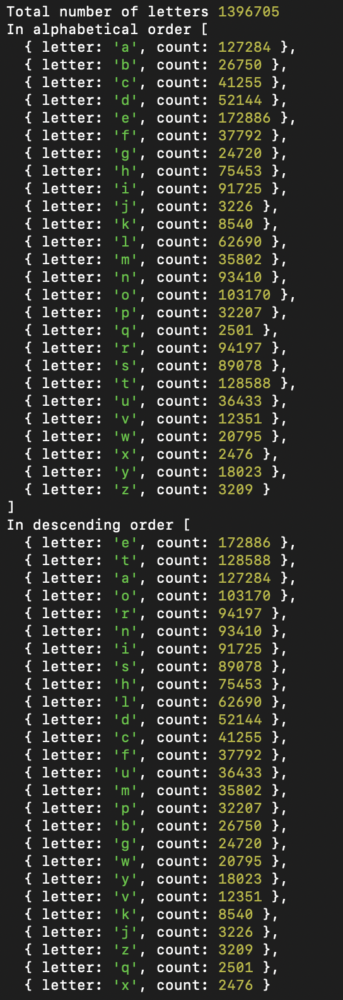
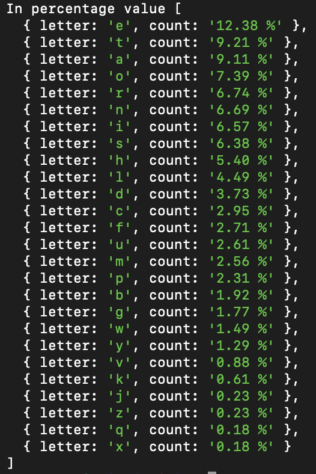
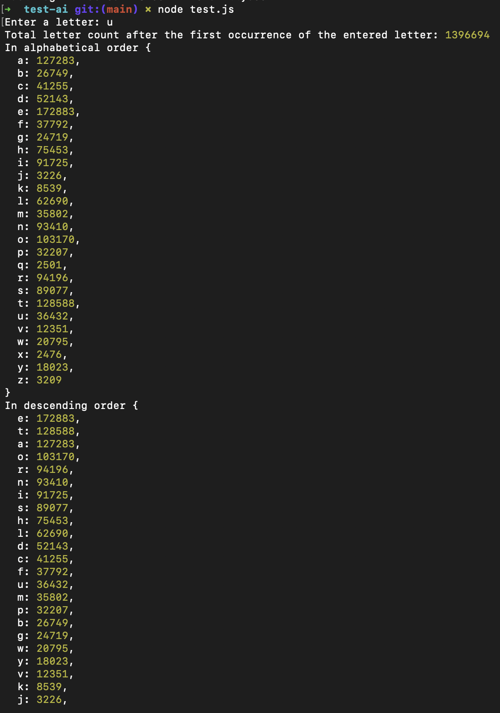
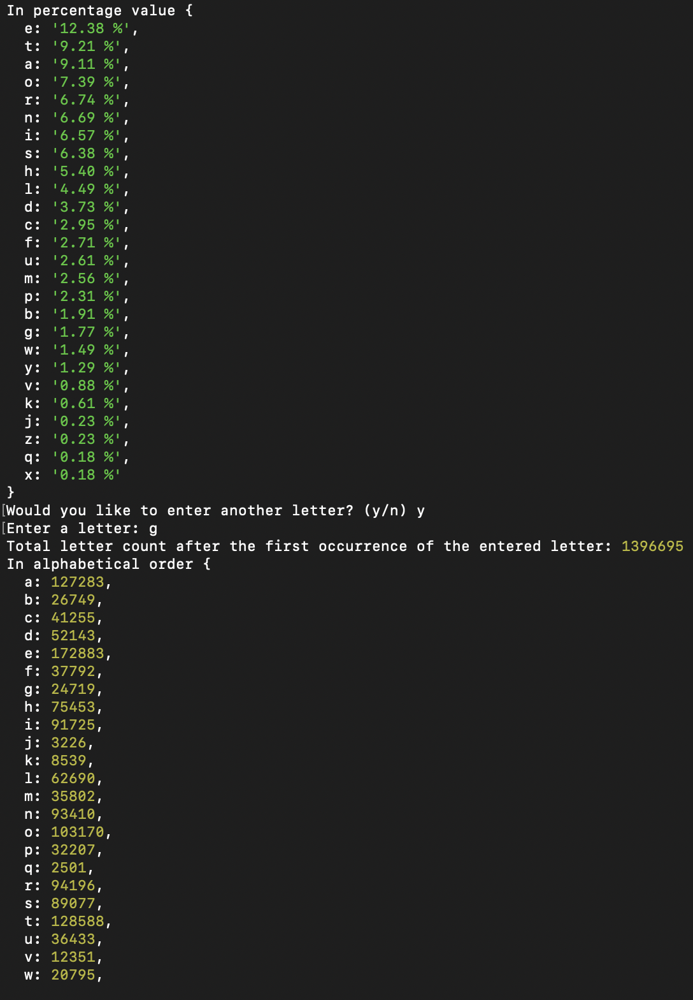
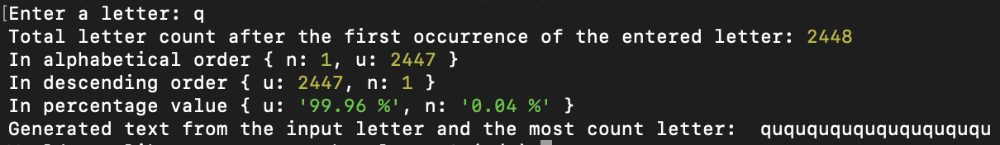

# Test-AI

## The first task

- Write a program that reads text and counts the occurrences of letters, ignoring spaces and punctuation. Treat lowercase and uppercase letters as identical.
- Display the counted letters in alphabetical order, in descending order of their occurrences, and their percentage values.

#### Results of the first task

## The second task

- Write a program that for given text will provide statistics of the letters that goes immediately after entered letter.
- Provide the ability to enter new letters without closing the program.

E.g. text: 'Hello, people of the world!' and entered letter is 'e'.
After each 'e' there are: one 'l', two 'o' and one 'w'.

#### Results of the second task

## The third task

Modify previous program in the way that it will generate a text (up to 200 characters long) in such way that next character will be the character with the most count of the current one, starting with input letter. If there are several letters with same count, it can choose any of them. If there is no such next letter, program finishes.

#### Results of the third task

