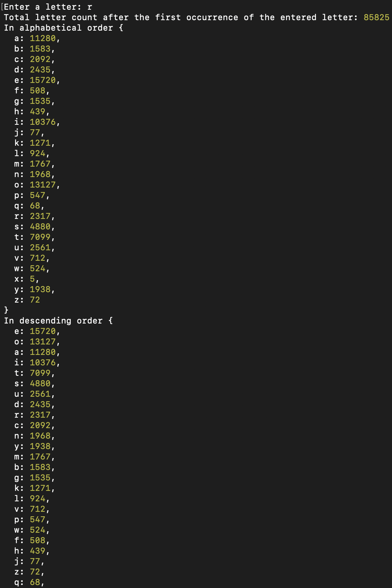

# Test-AI

## The first task

- Write a program that reads text and counts the occurrences of letters, ignoring spaces and punctuation. Treat lowercase and uppercase letters as identical.
- Display the counted letters in alphabetical order, in descending order of their occurrences, and their percentage values.

#### Results of the first task

## The second task

- Write a program that for given text will provide statistics of the letters that goes immediately after entered letter.
- Provide the ability to enter new letters without closing the program.

E.g. text: 'Hello, people of the world!' and entered letter is 'e'.
After each 'e' there are: one 'l', two 'o' and one 'w'.

#### Results of the second task

